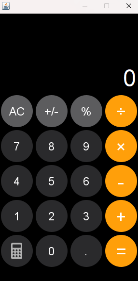
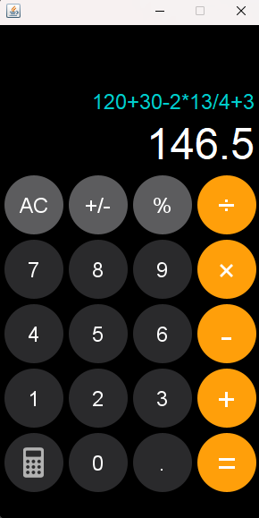

# iPhone Calculator (Java)

A simple iPhone-style calculator with iOS-like functionality, built using Java Swing.

## Features
- Basic operations: +, -, ×, ÷
- Memory functions: Clear (AC)
- Decimal support
- iPhone-inspired UI design
- Responsive layout

## Project Structure
```
Iphone-Calculator/
├── src/                  # Java source files
├── bin/                  # Compiled classes
├── lib/                  # External libraries
├── resources/            # Image assets
├── build.xml             # Ant build script
├── manifest.mf           # Project manifest
└── README.md             # Documentation
```

## Requirements
- Java JDK 8+
- Apache Ant (for build automation)
- Git (optional)
  
## Screenshot


## Installation
```bash
git clone https://github.com/yourusername/Iphone-Calculator.git
cd Iphone-Calculator
ant compile
ant run
```
##Manual Compilation
```bash
javac -d bin src/**/*.java
java -cp bin com.example.CalcProject
```
